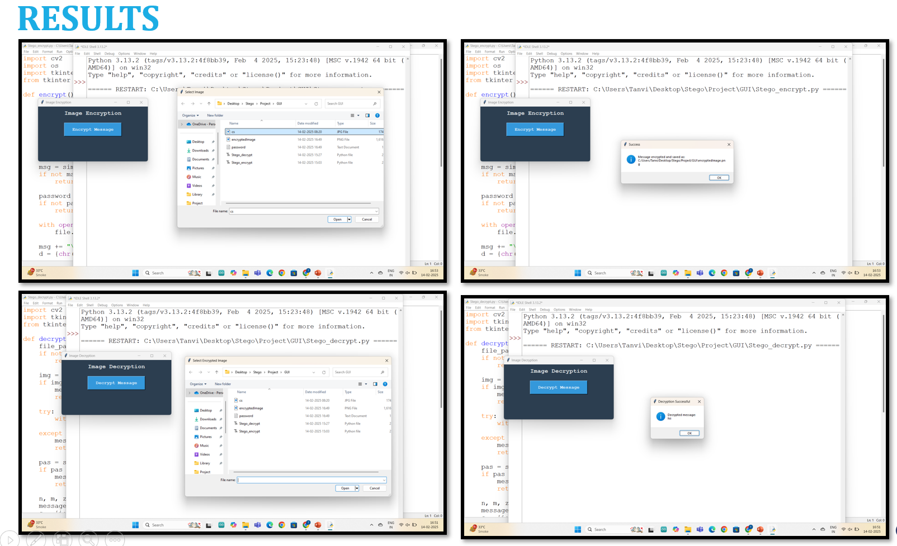

# Image Steganography Tool

A cybersecurity project based on image steganography that hides secret messages inside images using encryption and decryption techniques.

## Features
- Hide secret text inside images
- Encrypt confidential messages
- Decrypt hidden messages
- Basic cybersecurity implementation

## Technologies Used
- Python
- Image Processing
- Steganography

## Project Structure

- Stego_encrypt.py → Encrypts and hides message
- Stego_decrypt.py → Extracts hidden message
- cs.jpg → Sample image used
- AICTE_PPT_Tanvi_A → Project PPT

## How to Run

1. Run Stego_encrypt.py
2. Enter secret message
3. Generated image will contain hidden data
4. Run Stego_decrypt.py to retrieve the message

## Future Improvements
- GUI based application
- Multiple image format support
- Advanced encryption algorithms

## Output Screenshot

## Author
Tanvi Adivarekar
